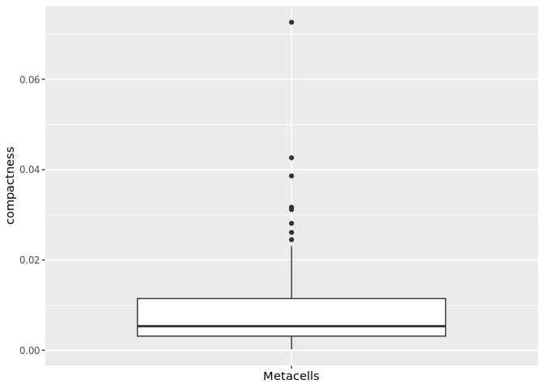
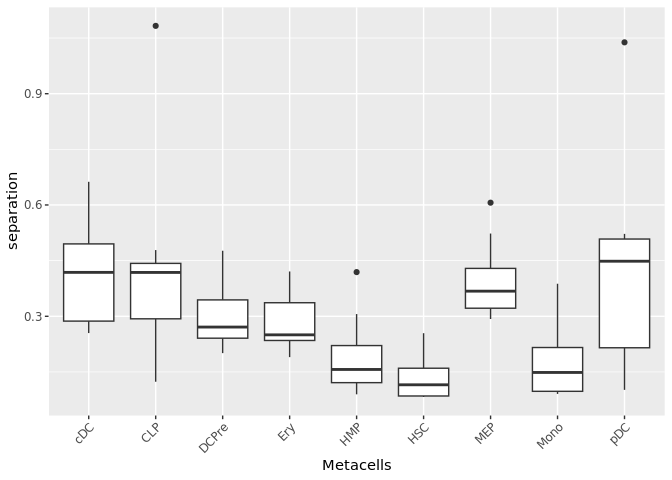
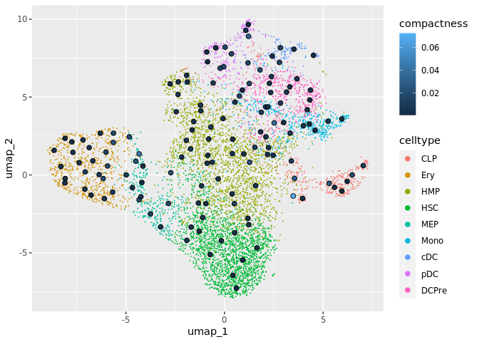

-   [Load data](#load-data)
-   [Compute quantitative metrics](#compute-quantitative-metrics)
    -   [Purity](#purity)
    -   [Compactness](#compactness)
    -   [Separation](#separation)
    -   [INV](#inv)
-   [Representativeness of metacells](#representativeness-of-metacells)

## Load data

    library(MetacellAnalysisToolkit)
    mc_data <- MetacellAnalysisToolkit::CD34_mc
    sc_data <- MetacellAnalysisToolkit::CD34_sc

## Compute quantitative metrics

### Purity

After each metacell has been annotated to the most abundant cell
category (*e.g.* cell type) composing the metacell, we can compute
metacells purity. If the annotation considered is the cell type, the
**purity** of a metacell is the proportion of the most abundant cell
type within the metacell.

    mc_data$purity <- mc_purity(membership = mc_data@misc$cell_membership$membership, annotation = sc_data$celltype)

    ## Loading required package: SeuratObject

    ## Loading required package: sp

    ## The legacy packages maptools, rgdal, and rgeos, underpinning this package
    ## will retire shortly. Please refer to R-spatial evolution reports on
    ## https://r-spatial.org/r/2023/05/15/evolution4.html for details.
    ## This package is now running under evolution status 0

    ## 
    ## Attaching package: 'SeuratObject'

    ## The following objects are masked from 'package:base':
    ## 
    ##     intersect, t

    qc_boxplot(mc.obj = mc_data, qc.metrics = "purity")

    qc_boxplot(mc.obj = mc_data, qc.metrics = "purity", split.by = "celltype")

### Compactness

The **compactness** of a metacell is the variance of the components
within the metacell. The lower the compactness value the better.

This metric, as well as the separation metric, are computed based on a
low embedding of the single-cell data, e.g. PCA embedding which we
generate in the next chunk.

    library(Seurat)
    sc_data <- NormalizeData(sc_data, normalization.method = "LogNormalize")
    sc_data <- FindVariableFeatures(sc_data, nfeatures = 2500)
    sc_data <- ScaleData(sc_data)

    ## Centering and scaling data matrix

    sc_data <- RunPCA(sc_data, npcs = 50, verbose = F)
    sc_data <- RunUMAP(sc_data, reduction = "pca", dims = c(1:50), n.neighbors = 15, verbose = F, min.dist = 0.5)

    ## Warning: The default method for RunUMAP has changed from calling Python UMAP via reticulate to the R-native UWOT using the cosine metric
    ## To use Python UMAP via reticulate, set umap.method to 'umap-learn' and metric to 'correlation'
    ## This message will be shown once per session

    UMAPPlot(sc_data, group.by = "celltype", reduction = "umap")

We compute these metrics in a diffusion map obtained from the pca.

    membership_df <- mc_data@misc$cell_membership
    diffusion_comp <- get_diffusion_comp(sc.obj = sc_data, dims = 1:30)

    ## Computing diffusion maps ...

    mc_data$compactness <- mc_compactness(cell.membership = membership_df,
                                          sc.obj = sc_data,
                                          sc.reduction = diffusion_comp)
    qc_boxplot(mc.obj = mc_data, qc.metrics = "compactness")

    qc_boxplot(mc.obj = mc_data, qc.metrics = "compactness", split.by = "celltype")

### Separation

The **separation** of a metacell is the distance to the closest metacell
\[@SEACells\]. The higher the separation value the better.

    mc_data$separation <- mc_separation(cell.membership = membership_df, 
                                        sc.obj = sc_data, 
                                        sc.reduction = diffusion_comp)
    qc_boxplot(mc.obj = mc_data, qc.metrics = "separation")

    qc_boxplot(mc.obj = mc_data, qc.metrics = "separation", split.by = "celltype")

### INV

The **inner normalized variance (INV)** of a metacell is the
mean-normalized variance of gene expression within the metacell. The
lower the INV value the better. Note that it is the only metric that is
latent-space independent.

    mc_data$INV <- mc_INV(cell.membership = membership_df, sc.obj = sc_data, group.label = "membership")

    ## Computing INV ...

    ## [1] "after get matrix"
    ## [1] "after do call"

    qc_boxplot(mc.obj = mc_data, qc.metrics = "INV")

    qc_boxplot(mc.obj = mc_data, qc.metrics = "INV", split.by = "celltype")

## Representativeness of metacells

To visualize the metacells, we can project the metacells on the
single-cell UMAP representation using the `mc_projection()` function
(adapted from the `plot.plot_2D()` from the SEACells package). A good
metacell partition should reproduce the overall structure of the
single-cell data by uniformly representing the latent space. To use this
function we need the data at the single-cell level (or at least an
low-dimensional embedding of the data) and the single-cell membership to
each the metacell.

    mc_projection(
      sc.obj = sc_data,
      mc.obj = mc_data,
      cell.membership = membership_df,
      sc.reduction = "umap",
      sc.label = "celltype", # single cells will be colored according the sc.label
      metacell.label = "celltype" # metacells cell will be colored according the metacell.label
      )

    # with custom colors:
    colors <- c("HMP" = "#BC80BD", "DCPre" = "#66A61E", "HSC" = "#A6761D",
                "Ery" = "#E41A1C", "MEP" = "#B3B3B3", "cDC" = "#A6D854", "CLP" = "#1F78B4", "Mono" = "#E6AB02", "pDC" = "#B2DF8A" )
    mc_projection(sc.obj = sc_data,
      mc.obj = mc_data,
      cell.membership = membership_df,
      sc.reduction = "umap",
      sc.label = "celltype", # single cells will be colored according the sc.label
      metacell.label = "celltype", # metacells cell will be colored according the metacell.label
      sc.color = colors,
      mc.color = colors)

By default the size of the metacells dots is proportionnal to the size
of the metacells. Metacells can also be colored by a continuous variable
such as one of the QC metrics computed in the previous chunks:

    mc_projection(
      sc.obj = sc_data,
      mc.obj = mc_data,
      cell.membership = membership_df,
      sc.reduction = "umap",
      sc.label = "celltype", # single cells will be colored according the sc.label
      continuous_metric = TRUE,
      metric = "compactness"
      )

